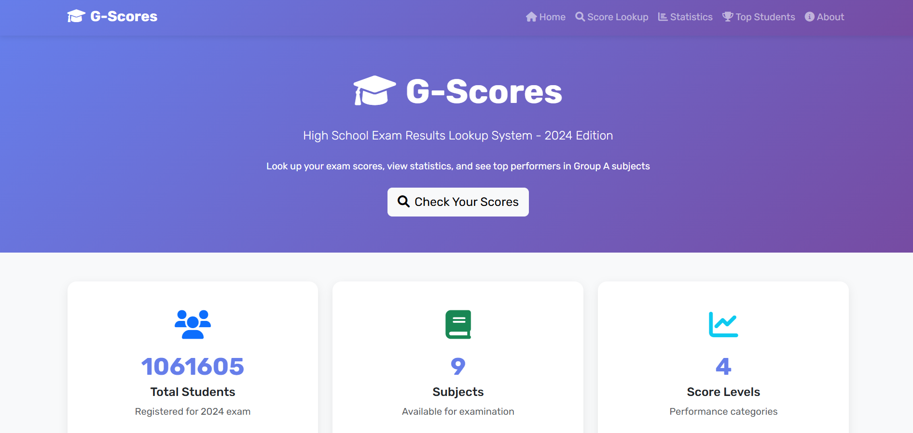

# G-Scores - High School Exam Results System

[](https://www.djangoproject.com/)
[](https://www.python.org/)
[](https://railway.app)

A comprehensive web application for managing and displaying high school exam results for the 2024 academic year.

## ✨ Features

- **Score Lookup**: Search student scores by registration number (SBD)
- **Statistics Dashboard**: Interactive charts showing score distribution
- **Top 10 Rankings**: Best performers in Math, Physics, Chemistry combination
- **CSV Data Import**: Automated data processing and import
- **Responsive Design**: Optimized for all devices

## � Screenshots

### Homepage



## �🚀 Live Demo

**Production**: [https://webdev-intern-assignment-3-production.up.railway.app](https://webdev-intern-assignment-3-production.up.railway.app)

## 🛠️ Tech Stack

- **Backend**: Django 4.2, MySQL
- **Frontend**: Bootstrap 5, Chart.js
- **Deployment**: Docker, Railway
- **Data**: Pandas for CSV processing

## 📦 Quick Start

### Local Development

1. **Clone the repository**

   ```bash
   git clone https://github.com/hason8193/webdev-intern-assignment-3.git
   cd webdev-intern-assignment-3
   ```

2. **Install dependencies**

   ```bash
   pip install -r requirements.txt
   ```

3. **Run migrations and import data**

   ```bash
   python manage.py migrate
   python manage.py import_scores
   ```

4. **Start development server**
   ```bash
   python manage.py runserver
   ```

### Docker Deployment

1. **Build and run with Docker**
   ```bash
   docker build -t gscores .
   docker run -p 8000:8000 gscores
   ```

### Railway Deployment

1. **Connect to Railway**

   - Fork this repository
   - Connect your GitHub repo to [Railway](https://railway.app)
   - Railway will auto-detect the Dockerfile

2. **Add Environment Variables**

   ```env
   SECRET_KEY=your-secret-key-here
   DEBUG=False
   ALLOWED_HOSTS=your-domain.railway.app,healthcheck.railway.app
   ```

3. **Add MySQL Database**

   - Add MySQL service in Railway dashboard
   - Railway will auto-provide `DATABASE_URL`

4. **Deploy**
   - Push changes to trigger deployment
   - Your app will be live with database connected

## 📊 Database Schema

### Models

- **Student**: Personal information and registration details
- **Subject**: Subject definitions (Math, Physics, Chemistry, etc.)
- **ForeignLanguage**: Language options (English, Japanese, etc.)
- **Score**: Individual subject scores linked to students

## 🔧 Management Commands

```bash
# Import student data from CSV
python manage.py import_scores

# Create admin user
python manage.py createsuperuser

# Database operations
python manage.py migrate
python manage.py collectstatic
```

## 📈 Score Classification

| Level         | Score Range | Description              |
| ------------- | ----------- | ------------------------ |
| Excellent     | 8.0 - 10.0  | Outstanding performance  |
| Good          | 6.0 - 7.9   | Good understanding       |
| Average       | 4.0 - 5.9   | Satisfactory performance |
| Below Average | 0.0 - 3.9   | Needs improvement        |

## 🏆 Group A Ranking

Students taking **Mathematics**, **Physics**, and **Chemistry** are ranked by their combined score in these subjects.

## 📂 Project Structure

```
gscores/
├── gscores/           # Django project settings
├── scores/            # Main application
├── static/            # CSS, JS, images
├── templates/         # HTML templates
├── dataset/           # CSV data files
├── Dockerfile         # Docker configuration
├── requirements.txt   # Python dependencies
└── railway.toml       # Railway deployment config
```

## 🌟 Admin Interface

Access the admin panel at `/admin/` with superuser credentials to manage:

- Students and their information
- Subjects and scoring
- Foreign language options
- Data import/export

## 📝 License

This project is for educational purposes and demonstrates Django web development skills.

---

**Deployed on Railway** | [Live Demo](https://webdev-intern-assignment-3-production.up.railway.app)

### Common Issues

**1. Import Command Fails**

```bash
# Check file path and permissions
ls -la dataset/diem_thi_thpt_2024.csv
# Ensure CSV format is correct
```

**2. Database Connection Error**

```bash
# For MySQL: Check connection
python manage.py dbshell
# Check MySQL service status
# Windows: services.msc -> MySQL
# Linux/Mac: sudo systemctl status mysql

# Verify database exists
mysql -u root -p
SHOW DATABASES;
USE gscores_db;

# Check Django database settings
python manage.py showmigrations
```

**3. Static Files Not Loading**

```bash
# Collect static files
python manage.py collectstatic --clear
# Check STATIC_URL settings
```

## 📞 Support

### Getting Help

- **Issues**: [GitHub Issues](https://github.com/hason8193/webdev-intern-assignment-3/issues)
- **Documentation**: [Django Documentation](https://docs.djangoproject.com/)
- **Community**: [Django Community](https://www.djangoproject.com/community/)

### Author

**Project Developer**

- GitHub: [@hason8193](https://github.com/hason8193)

## 🙏 Acknowledgments

- **Golden Owl**: For providing the internship opportunity and assignment
- **Django Community**: For the excellent web framework
- **Bootstrap Team**: For the responsive CSS framework
- **Chart.js**: For the beautiful data visualization library
- **Font Awesome**: For the comprehensive icon library

---

## 📋 Assignment Completion Checklist

### Must Have Requirements ✅

- [x] **CSV Data Import**: ✅ Management command with batch processing
- [x] **Score Lookup**: ✅ Form-based search with validation
- [x] **Score Reports**: ✅ 4-level classification system
- [x] **Statistics**: ✅ Subject-wise analysis with charts
- [x] **Top 10 Group A**: ✅ Math + Physics + Chemistry ranking

### Nice to Have Requirements ✅

- [x] **Responsive Design**: ✅ Bootstrap 5 with mobile optimization
- [x] **Docker Setup**: ✅ Complete containerization
- [x] **Live Deployment**: ✅ Ready for multiple platforms

### Technical Requirements ✅

- [x] **OOP Programming**: ✅ Subject management with OOP principles
- [x] **Form Validation**: ✅ Client and server-side validation
- [x] **Django ORM**: ✅ Optimized database interactions
- [x] **Security**: ✅ CSRF, validation, and secure headers

---

**Built with ❤️ for Golden Owl Assignment**

## 👥 Contributors

- **Edric Cao** (Golden Owl) - Original Assignment Creator
- **Project Developer** - Implementation and Development

## 📄 License

This project is created for educational purposes as part of the Golden Owl web developer internship assignment.
